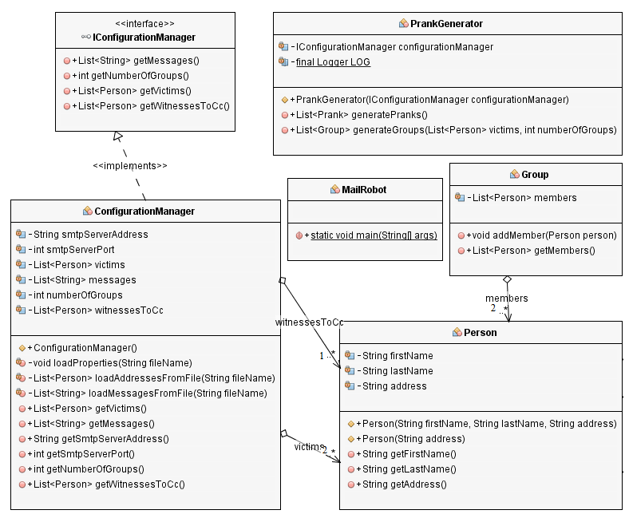
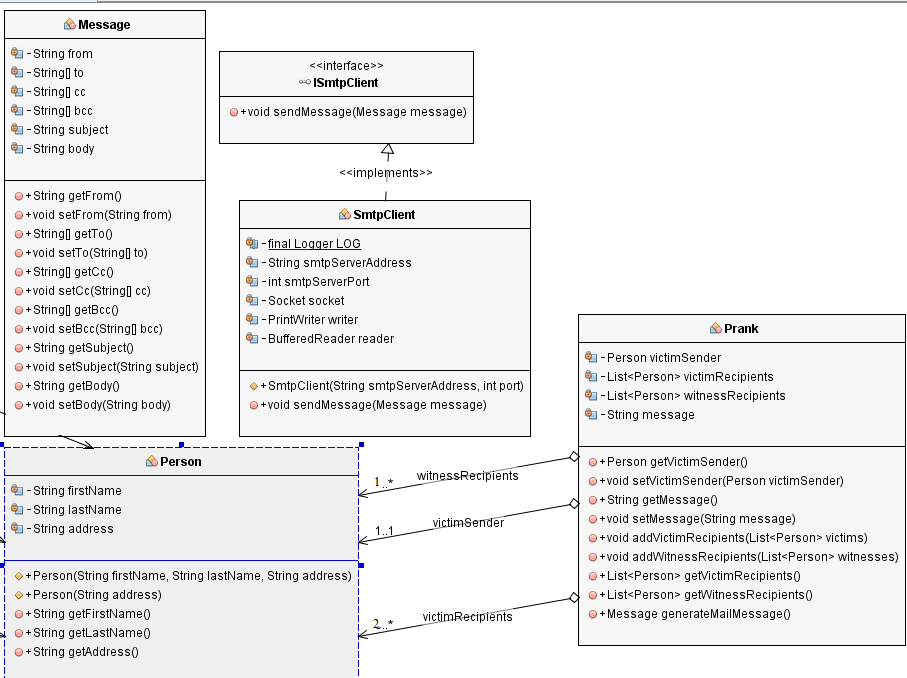

Project description
=
This project is a prank by sending that send forged emails to different groups of people.
In this implementation, It is posible to choose the number of groups to send them the emails.

Instructions practice
=
To test our project, and to avoid sending emails to several people during the test, we need a software that simulates the mail server. 
We used the MockMock server that simulates the mail server. 
MockMock is a cross-platform SMTP server built on Java. It allows you to test if outgoing emails are sent (without actually sending them) 
and to see what they look like. It provides a web interface that displays which emails were sent and shows you what the contents of those 
emails are. If you use MockMock you can be sure that your outgoing emails will not reach customers or users by accident. It really just is 
a mock SMTP server and has no email sending functionality.
The next section will explain how to install it!

Implementation Instructions server Mock. How to install? How to start?
=
to install the server Mock Mock, first we used the following link to get all the project:
[https://github.com/tweakers-dev/MockMock](https://github.com/tweakers-dev/MockMock)

we download all the project. After getting all the project locally, the terminal is opened and moves towards the project. when we find ourselves 
in the project, we move to the folder where there's pom.xml
And now to complete the build, we type the following command:
mvn clean install

Now the project is ready to be executed. in the console, we move to the target folder. In this folder there is a calling file
MockMock-1.4.0.one-jar.jar

 To run MockMock , we start it with the following parameters: 
 java -jar MockMock-1.4.0.one-jar.jar -p 2525

This will run MockMock on SMTP port 2525.

We see the following message: 
avr. 20, 2016 10:33:28 AM org.springframework.context.support.ClassPathXmlAppli
ationContext prepareRefresh
INFOS: Refreshing org.springframework.context.support.ClassPathXmlApplicationCo
text@1b3120a: startup date [Wed Apr 20 10:33:28 CEST 2016]; root of context hie
archy
avr. 20, 2016 10:33:28 AM org.springframework.beans.factory.xml.XmlBeanDefiniti
nReader loadBeanDefinitions
INFOS: Loading XML bean definitions from class path resource [META-INF/beans.xm
]
Starting MockMock on port 2525
[main] INFO org.subethamail.smtp.server.SMTPServer - SMTP server *:2525 startin

[org.subethamail.smtp.server.ServerThread *:2525] INFO org.subethamail.smtp.ser
er.ServerThread - SMTP server *:2525 started
Path to resources folder: ./static
Starting http server on port 8282
[main] INFO org.eclipse.jetty.server.Server - jetty-8.1.8.v20121106
[main] INFO org.eclipse.jetty.server.AbstractConnector - Started SelectChannelC
nnector@0.0.0.0:8282

In summary, the message said the Mock Mock is listening on the port 2525 
and the http server is listening on the port 8282.

we open a brower and we type 
localhost:8282

now, Mock Mock is ready. 

We are going to our project. and we run our "main" 
for example, if we should send email to 3 groups, we can see the next message that confirms that :

Email from a20@res.ch received.
Email from a6@res.ch received.
Email from a12@res.ch received.

And the Mock Mock interface as we see appear the 3 emails.

class diagram
=
This is the first class diagram

and this is the seconde diagram
 

